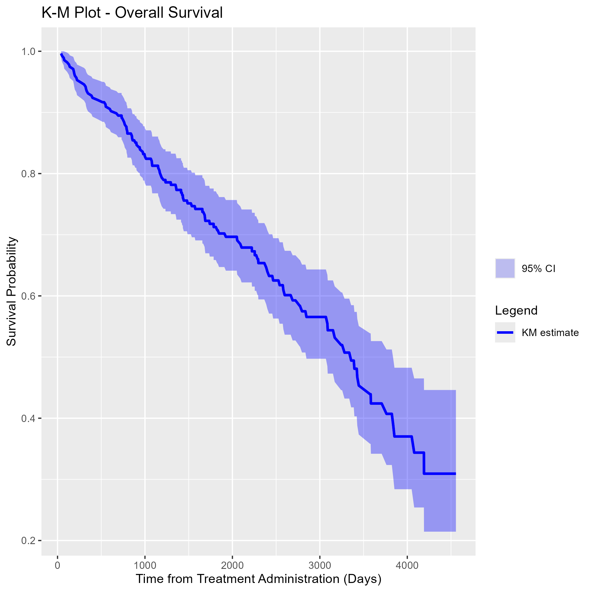
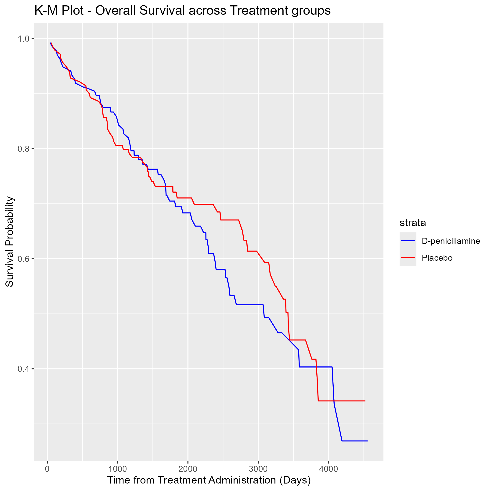

```{r setup, include=FALSE}
knitr::opts_chunk$set(echo = TRUE)
```

# Required Libraries
This project requires the following libaries:
```{r, message=FALSE}
# Install Required package
for (package in c("here", 
                  "knitr", 
                  "dplyr",
                  "ggplot2")){
  if (!requireNamespace(package, quietly = TRUE)) {
    install.packages(package)
  }
}
  
library(ggplot2)
library(dplyr)
```

# Introduction

This analysis utilizes the Cirrhosis Prediction Dataset obtained from Kaggle, containing 18 clinical features used to predict the survival state of patients with liver cirrhosis. The dataset was created to analyze the effects of prolonged liver damage, which often results from conditions such as hepatitis or chronic alcohol consumption. This study aims to explore the relationships between clinical variables and patient survival outcomes, as well as to identify key predictors for liver cirrhosis stage.

The dataset includes patients from a Mayo Clinic study on primary biliary cirrhosis (PBC) of the liver, carried out from 1974 to 1984. During 1974 to 1984, 424 PBC patients referred to the Mayo Clinic qualified for the randomized placebo-controlled trial testing the drug D-penicillamine. Of these, the initial 312 patients took part in the trial and have mostly comprehensive data. The remaining 112 patients didn't join the clinical trial but agreed to record basic metrics and undergo survival tracking. Six of these patients were soon untraceable after their diagnosis, leaving data for 106 of these individuals in addition to the 312 who were part of the randomized trial.
Our primary objective is to understand the impact of various clinical features on patient outcomes, particularly in terms of survival and cirrhosis progression.

# Data Description:
### The following data preprocessing had been performed:
- Drop all the rows where miss value (NA) were present in the Drug column
- Impute missing values with mean results
- One-hot encoding for all category attributes

### Detailed Description of each variable:
1) ID: unique identifier
2) N_Days: number of days between registration and the earlier of death, transplantation, or study analysis time in July 1986
3) Status: status of the patient C (censored), CL (censored due to liver tx), or D (death). For the purpose of our analysis, CL was standardized as C.
4) Drug: type of drug D-penicillamine or placebo
5) Age: age in [days]
6) Sex: M (male) or F (female)
7) Ascites: presence of ascites N (No) or Y (Yes)
8) Hepatomegaly: presence of hepatomegaly N (No) or Y (Yes)
9) Spiders: presence of spiders N (No) or Y (Yes)
10) Edema: presence of edema N (no edema and no diuretic therapy for edema), S (edema present without diuretics, or edema resolved by diuretics), or Y (edema despite diuretic therapy)
11) Bilirubin: serum bilirubin in [mg/dl]
12) Cholesterol: serum cholesterol in [mg/dl]
13) Albumin: albumin in [gm/dl]
14) Copper: urine copper in [ug/day]
15) Alk_Phos: alkaline phosphatase in [U/liter]
16) SGOT: SGOT in [U/ml]
17) Triglycerides: triglicerides in [mg/dl]
18) Platelets: platelets per cubic [ml/1000]
19) Prothrombin: prothrombin time in seconds [s]
20) Stage: histologic stage of disease (1, 2, 3, or 4)


### Set Project Folder
```{r load-data}
here::i_am("final_report.Rmd")
```

### Tables: Descriptive Statistics
The following table provides an overview of the clinical features present in the dataset, including demographic details like age and sex, and clinical markers such as bilirubin, albumin, and cholesterol levels. 

Numeric Variables
```{r, echo=FALSE}
numeric_table = readRDS(
  here::here("outputs/table_numeric.rds")
)
numeric_table
```

Categorical Variables
```{r, echo=FALSE}
categorical_table = readRDS(
  here::here("outputs/table_categorical.rds")
)
categorical_table
```


# Figures

### Distribution of Age by Survival State
The following figure illustrates the distribution of patient age across different survival states. 

From this box plot, we can find that the median ages across the three survival states are similar, roughly between 19,000 and 20,000 days.
The age distribution in the "CL" state is somewhat narrower compared to the "C" and "D" states, suggesting a more concentrated age range in this state. Besides, the age distributions in the "C" and "D" states are broader with similar interquartile ranges, indicating greater age variability in these states. Overall, there is some overlap in the age distributions across the three states, suggesting that age may not be the sole or most critical factor distinguishing these conditions.
```{r, echo=FALSE}
Age_by_Survival = readRDS(here::here("outputs/plot_ageByState.rds"))
Age_by_Survival
```

### More: Histograms of N_Days and Age
```{r histograms, fig.width=7, fig.height=5, message=FALSE}
HIST_N_Days = readRDS(here::here("outputs/plot_NDaysHIST.rds"))
HIST_N_Days
HIST_Age = readRDS(here::here("outputs/plot_AgeHIST.rds"))
HIST_Age
```

### More: Kaplan-Meier (K-M) plot for overall survival and survival across treatment groups
We also want to check the overall survival of patients and survival by treatment, using K-M plots.
```{r, echo=FALSE}
KM_Overall = readRDS(file = here::here("outputs/plot_KMOverall.rds"))
KM_Overall
# 
```

```{r, echo=FALSE}
KM_byTrt = readRDS(file = here::here("outputs/plot_KMbyTrt.rds"))
KM_byTrt
# 
```


This initial analysis presents an overview of the Cirrhosis Prediction Dataset and provides some preliminary insights into patient demographics and outcomes. In subsequent analyses, we will further explore the relationships between different clinical features and their impact on survival and cirrhosis progression.


